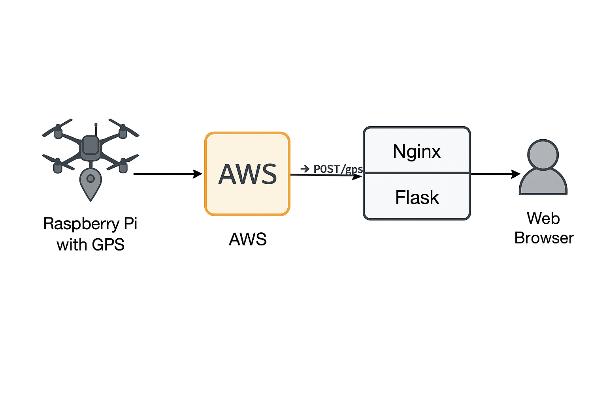

# J123 캡스톤 디자인

# 깃허브 최상위 폴더
- app.py: Flask 실행파일
- assets: README.md에 사용될 이미지 등을 저장
- static: 자바스크립트 등 정적 웹페이지 구성요소 저장
- templates: index.html 등 웹 페이지 저장

# 깃허브 브랜치 설명
- main: 문서화 및 전체 코드 업로드
- deploy: README.md, assets 같은 폴더를 제외하고 실제 클라우드에 올릴 코드만 업로드

# 웹페이지 설명


## Flask 페이지
Flask 페이지는 서버에서 localhost로만 실행되며, GPS 정보를 화면에 표시

### /
index 페이지이며, 저장된 위치 정보를 출력

### /submit
위치 정보를 입력받는 페이지이며 다음과 같은 명령어로 입력 가능
```bash
curl -X POST -d "value=gpsValue" http://localhost:5000/submit/
```

### /position
위치 정보를 json 형태로 저장하는 페이지이며, 자동 갱신 기능 활성 시 사용

## nginx 서버
사용자는 nginx proxy를 통해 접속하고, nginx가 flask 페이지와 사용자 중간에 위치


