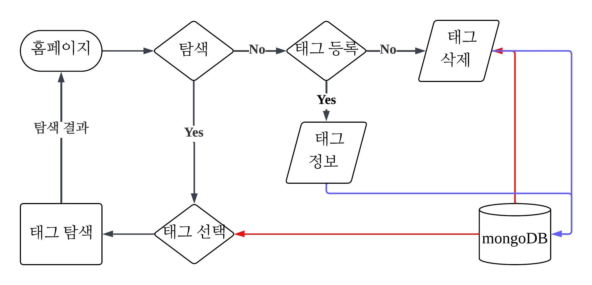
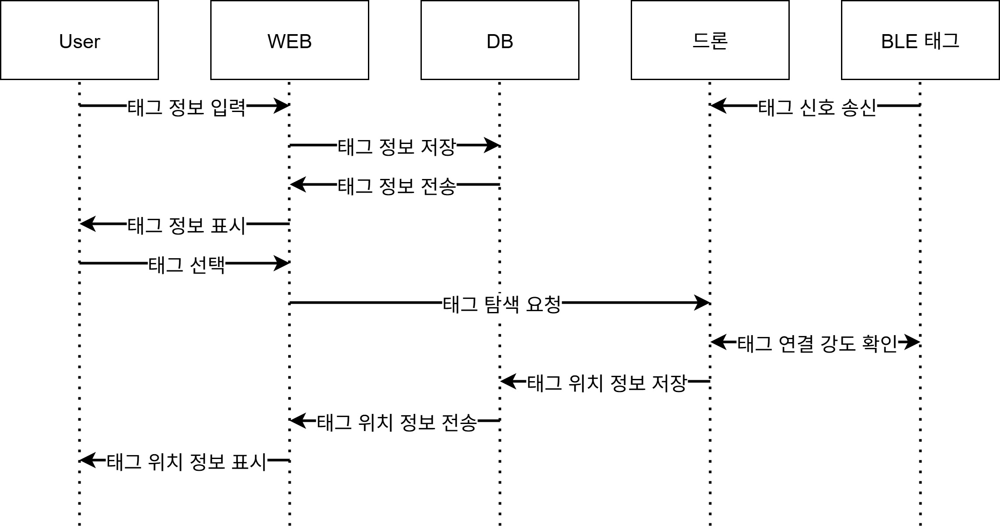
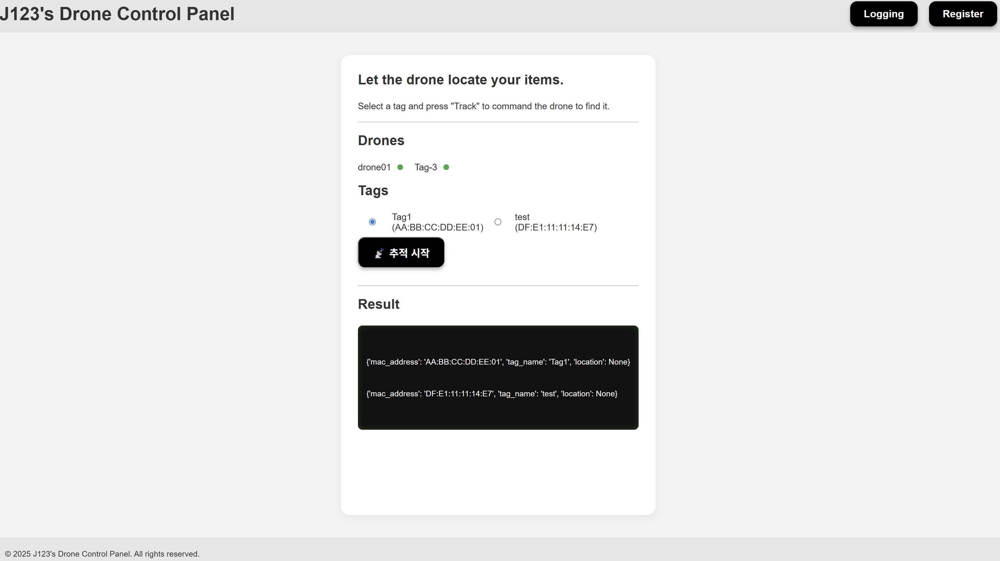
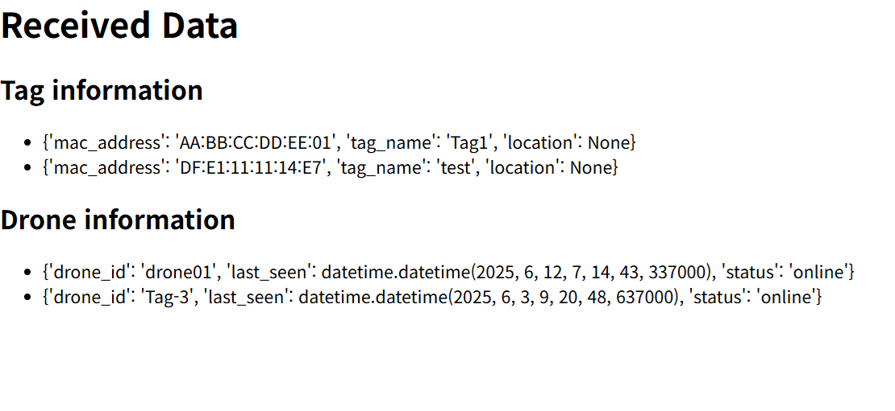
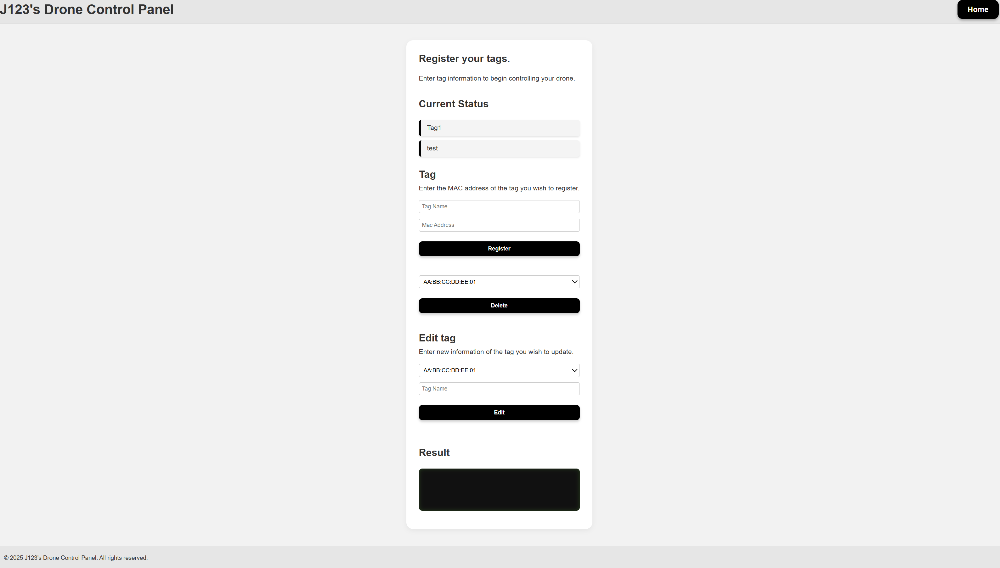

# J123 캡스톤 디자인

# 트리 구조
```
.
├── README.md
├── assets
│   ├── SequenceDiagram.jpg
│   └── flowchart.jpeg
├── drone
│   ├── SERCH.py
│   ├── controller.py
│   ├── main
│   │   ├── drone_client.py
│   │   ├── simul.py
│   │   └── tracking.py
│   └── socket
│       ├── Client RSSI scan.py
│       ├── RSSI scan.py
│       ├── Tracking.py
│       └── client.py
└── origin
    ├── app.py                   # Flask
    ├── db.py
    ├── dronedb.py
    ├── run_server.py
    ├── server.py
    ├── static                   # CSS, JS 등
    │   ├── css
    │   │   ├── style.css
    │   │   └── style_bak.css
    │   └── js
    │       ├── autoReload.js
    │       └── status.js
    └── templates                # 페이지별 HTML
        ├── index.html
        ├── logging.html
        └── register.html
```

# 깃허브 브랜치 설명
- main: 문서화 및 전체 코드 업로드
- deploy: README.md, assets 같은 폴더를 제외하고 실제 클라우드에 올릴 코드만 업로드

# 프로젝트 구조
## 플로우 차트


## 시퀀스 다이어그램


# 웹페이지

## /

홈페이지<br/>
드론 조작 및 로깅 정보 확인 가능

## /logging

로깅 페이지<br/>
임시 페이지이며, 로깅 정보만 확인 가능

## /register

등록 페이지<br/>
태그 등록/삭제, 로깅 지원

# MongoDB
```MongoDB
[
  {
    _id: ObjectId('68024808fb70db1095d861e2'),
    name: 'Drone 01',
    last_seen: ISODate("2025-06-27T07:14:43.337Z'),
    status: 'online'
   }
  {
    _id: ObjectId('68024808fb70db1095d861e2'),
    mac_address: 'AA:BB:CC:DD:EE:01',
    tag_name: 'Tag-1',
    location: 'Null'
  }
]
```

## Flask /submit 라우트
### 등록
```python
@app.route('/submit/register/tag/', methods=['POST'])
def registerTag():
   macAddress = request.form.get('macAddress')
   tagName = request.form.get('tagName')
   location = request.form.get('location')
   result, statusCode = db.register_tag(macAddress, tagName, location)
   if statusCode != 201:
      flash(result["error"], "error")
   else:
      flash(result["message"], "success")
   return redirect(url_for('register'))
```
HTTP POST 방식으로 요청을 받고 `db.register_tag()` 함수로 **DB(tags 컬렉션)** 에 저장<br>

### 수정
```python
@app.route('/submit/edit/tag/', methods=['POST'])
def editTag():
   macAddress = request.form.get('macAddress')
   tagName = request.form.get('tagName')
   result, statusCode = db.update_tag(macAddress, tagName)
   if statusCode != 200:
      flash(result["error"], "error")
   else:
      flash(result["message"], "success")
   return redirect(url_for('register'))
```
HTTP POST 방식으로 요청을 받고 `db.update_tag()` 함수로 **DB(tags 컬렉션)** 수정<br>

### 삭제
```python
@app.route('/submit/delete/tag/', methods=['POST'])
def deleteTag():
   macAddress = request.form.get('deleteTag')
   result, statusCode = db.delete_tag(macAddress)
   if statusCode != 200:
      flash(result["error"], "error")
   else:
      flash(result["message"], "success")
   return redirect(url_for('register'))
```
HTTP POST 방식으로 요청을 받고 `db.delete_tag()` 함수로 **DB(tags 컬렉션)** 에서 삭제<br>
